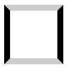

# 坎帕斯前端学院 
***
## 学习笔记
### 通信与信息工程学院  谌放  2016210574

* QQ：575923486 
* 邮箱：[**@小丑的独角戏台**](https://mail.qq.com/cgi-bin/frame_html?sid=3cMc4wafMGNvDix1&r=db865c2e4d244aa94e56a0ca229d3f9c)
* Github：[**@C-Fun**](https://github.com/C-Fun)
***

# 移动web前端开发

## meta

### 视窗宽度

    <meta name="viewport" content="width=device-width,initial-scale=1.0,minimum-scale=1.0,maximum-scale=1.0,user-scalable=no"/>

其中 width=device-width 是设置视窗宽度为设备视窗宽度，还可以固定宽度，例如： width=640 则是640px的宽度（常见于微信）；

initial-scale=1.0 ：设置缩放比例为1.0；

minimum-scale=1.0 和 maximum-scale=1.0 ：最小缩放比例和最大缩放比例；

user-scalable=no ：禁止用户自由缩放，user-scalable 默认值为 yes 。

提示：刚刚那个是带全部参数的，一般常用的，有 user-scalable=no 就不用使用 minimum-scale=1.0 和 maximum-scale=1.0 来强制禁止缩放了。

	<meta name="viewport" content="width=device-width,initial-scale=1.0,user-scalable=no"/>

### 自动识别格式

	<meta name="format-detection" content="telephone=no"/>

content 里面的参数：telephone=no 是禁止浏览器自动识别手机号码，email=no 是禁止浏览器自动识别Email。

###完整模版

	<meta name="viewport" content="width=device-width,initial-scale=1.0,user-scalable=no"/>
	<meta name="format-detection" content="telephone=no"/>
	<meta name="format-detection" content="email=no"/>

## CSS

	body 
	{
	    font-family: "Helvetica Neue", Helvetica, STHeiTi, sans-serif; /*使用无衬线字体*/
	}
	
	a, img {
	    -webkit-touch-callout: none; /*禁止长按链接与图片弹出菜单*/
	}
	
	html, body {
	    -webkit-user-select: none; /*禁止选中文本*/
	    user-select: none;
	}
	
	button,input,optgroup,select,textarea {
	    -webkit-appearance:none; /*去掉webkit默认的表单样式*/
	}
	
	a,button,input,optgroup,select,textarea {
	    -webkit-tap-highlight-color:rgba(0,0,0,0); /*去掉a、input和button点击时的蓝色外边框和灰色半透明背景*/
	}
	
	input::-webkit-input-placeholder {
	    color:#ccc; /*修改webkit中input的planceholder样式*/
	}
	
	input:focus::-webkit-input-placeholder {
	    color:#f00; /*修改webkit中focus状态下input的planceholder样式*/
	}
	
	body {
	    -webkit-text-size-adjust: 100%!important; /*禁止IOS调整字体大小*/
	}
	
	input::-webkit-input-speech-button {
	    display: none; /*隐藏Android的语音输入按钮*/
	}
		
## Flex

假设flex容器为 .box ，子元素为 .item 。

### 定义容器为Flex布局

	.box{
		display: -webkit-flex; /*webkit*/
		display: flex;
	}
	
	/*行内flex*/
	.box{
	    display: -webkit-inline-flex; /*webkit*/
	    display:inline-flex;
	}

### 容器样式

	.box{
    	flex-direction: row | row-reverse | column | column-reverse;
		/*主轴方向：左到右（默认） | 右到左 | 上到下 | 下到上*/

    	flex-wrap: nowrap | wrap | wrap-reverse;
    	/*换行：不换行（默认） | 换行 | 换行并第一行在下方*/

    	flex-flow: <flex-direction> || <flex-wrap>;
    	/*主轴方向和换行简写*/

	    justify-content: flex-start | flex-end | center | space-between | space-around;
    	/*主轴对齐方式：左对齐（默认） | 右对齐 | 居中对齐 | 两端对齐 | 平均分布*/

    	align-items: flex-start | flex-end | center | baseline | stretch;
	    /*交叉轴对齐方式：顶部对齐（默认） | 底部对齐 | 居中对齐 | 上下对齐并铺满 | 文本基线对齐*/

	    align-content: flex-start | flex-end | center | space-between | space-around | stretch;
    	/*多主轴对齐：顶部对齐（默认） | 底部对齐 | 居中对齐 | 上下对齐并铺满 | 上下平均分布*/
	}

### 子元素样式

	.item{
	    order: <integer>;
	    /*排序：数值越小，越排前，默认为0*/
	
	    flex-grow: <number>; /* default 0 */
	    /*放大：默认0（即如果有剩余空间也不放大，值为1则放大，2是1的双倍大小，以此类推）*/
	
	    flex-shrink: <number>; /* default 1 */
	    /*缩小：默认1（如果空间不足则会缩小，值为0不缩小）*/
	
	    flex-basis: <length> | auto; /* default auto */
	    /*固定大小：默认为0，可以设置px值，也可以设置百分比大小*/
	
	    flex: none | [ <'flex-grow'> <'flex-shrink'>? || <'flex-basis'> ]
	    /*flex-grow, flex-shrink 和 flex-basis的简写，默认值为0 1 auto，*/
	
	    align-self: auto | flex-start | flex-end | center | baseline | stretch;
	    /*单独对齐方式：自动（默认） | 顶部对齐 | 底部对齐 | 居中对齐 | 上下对齐并铺满 | 文本基线对齐*/
}

## 小技巧

### 定义苹果图标

在网站文件根目录放一个 apple-touch-icon.png 文件，苹果设备保存网站为书签或桌面快捷方式时，就会使用这个文件作为图标，文件尺寸建议为：180px × 180px。

### 自定义favicon

	<link rel="icon" href="favicon.ico" mce_href="favicon.ico" type="image/x-icon">

### 定义浏览器点击行为

	<a href="tel:020-10086">打电话给:020-10086</a>
	<a href="sms:10086">发短信给: 10086</a>
	<a href="mailto:me@22278.club">发送邮件: me@22278.club</a>

### 定义上传文件类型和格式

	<input type=file accept="image/*">

上面的文件上传框中，accept 可以限制上传文件的类型，

参数为 image/* 是所有图片类型，点击会弹出图库，也可以指定图片格式，参数设置成 image/png 则可以限制图片类型为png；

参数如果为 video/* 则是选择视频的意思；

accept 还可以设置多个文件格式，语法为 accept="image/gif, image/jpeg" ；

### 使用box-shadow改变(挡住)表单自动填充后的黄色

	input:-webkit-autofill, textarea:-webkit-autofill, select:-webkit-autofill{
    	box-shadow:inset 0 0 0 1000px #fff;
	}

### 使用CSS实现省略号文字截断

	white-space: nowrap;
	text-overflow: ellipsis;

### 使用border绘制小三角

原理是：上下和左右的边框对接其实是个斜角，利用这个特性，使其中一边的边框透明，另外一边写成想要的颜色并隐藏对边，就可以变成小箭头形状。

	border-width: 10px 10px 10px 0; //左箭头
	border-color: transparent #fff;
	border-style: solid;
	width: 0;

## 示例：

	<!--html-->
	
嗨！点击菜单就可以关注兮兮公众号了哟~

	/*--css--*/
	.box{
	    position: relative;
	    padding: 0 20px;
	    width: 380px;
	    height: 80px;
	    border-radius: 8px;
	    background: #efefef;
	    font-size: 18px;
	    line-height: 80px;
	}
	.box:after{
	    position: absolute;
	    top: 50%;
	    left: -15px;
	    z-index: 1;
	    display: block;
	    margin-top: -15px;
	    width: 0;
	    border-color: transparent #efefef;
	    border-style: solid;
	    border-width: 15px 15px 15px 0;
	    content: "";
	}

