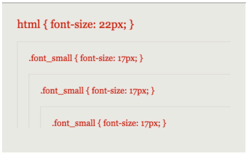
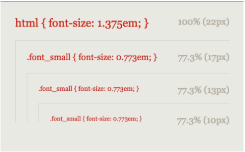
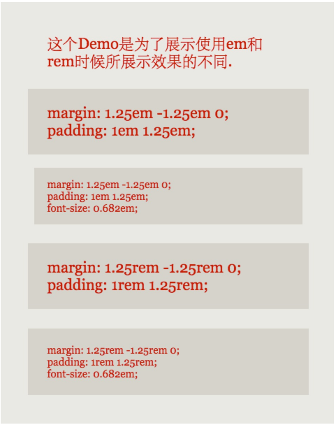
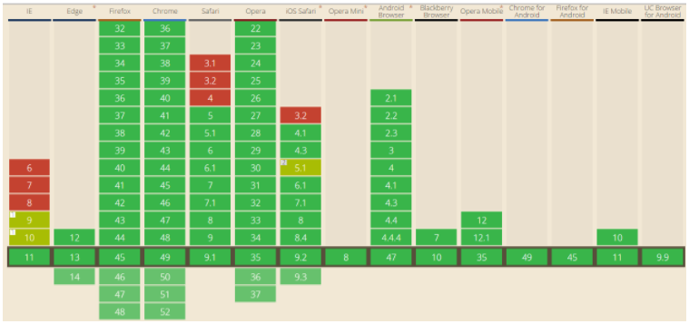
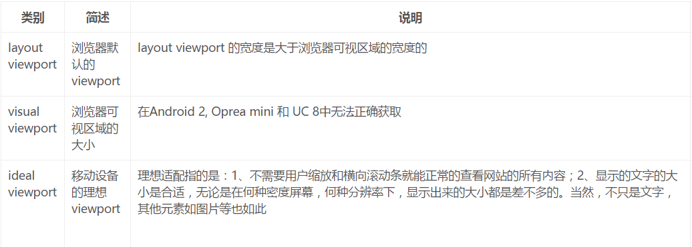
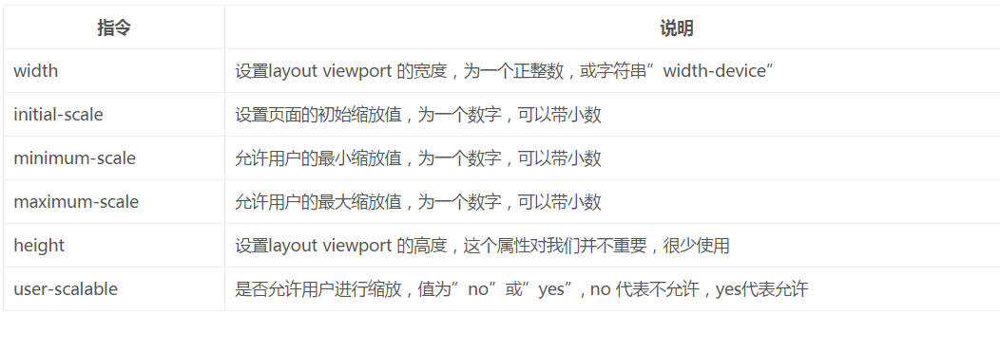

# 坎帕斯前端学院
---
## 学习笔记
### 通信与信息工程学院  谌放  2016210574

* QQ：575923486 
* 邮箱：[**@小丑的独角戏台**](https://mail.qq.com/cgi-bin/frame_html?sid=3cMc4wafMGNvDix1&r=db865c2e4d244aa94e56a0ca229d3f9c)
* Github：[**@C-Fun**](https://github.com/C-Fun)

***
## 第十五周学习笔记

## h5 手机屏幕适配-REM

### rem/em/px之间的关系

* px
 
	

	字体恒定没有变化

* em
	
	

	字体大小依次在减少

* rem

	

	单位em字体大小是相对直接或者是最近的父级，但单位rem的大小则是相对于html(根元素)字体大小

>
通过对比会发现：只是单位使用不一样但效果却是截然不同的。rem和em都是相对单位，px则不是。
>
在CSS样式表中，单位em是作为字体高度的单位来使用的，但实际字体大小的高度显示是用户对DPI的定义来决定的。为了改善这种样式规则，单位rem则是直接取决于文档根元素字体默认大小，也可以理解为root em，跟em有所不同的是使用rem单位的字体大小在整个文档中都是恒定不变的

### rem

**rem 的官方定义：The font size of the root element，即以根节点的字体大小作为基准值进行长度计算。**

**兼容性：**
	 

* 大部分主流浏览器支持，但要注意IE9、IE10
* iOS：6.1系统以上都支持
* Android：2.1系统以上都支持

### rem用来解决的问题

先不谈安卓，就以iphone各种手机的尺寸来说，iPhone4,5 宽度320px，iPhone6 375px，iPhone6 plus 414px. iPad 768px。如果一个按钮，固定一个75x25的尺寸，那么就必然会导致在不同尺寸下的相对大小不一样。这带来的问题就在于会直接影响到设计的美观，可能在iPhone6下，一个完美的设计图，到了iPhone5,就变得low很多。**为了让页面元素的尺寸能够在设备宽度变化的时候也跟着变化，rem就出现了。**

使用rem适配的原理就是我们只需要在设备宽度大小变化的时候，调整html的字体大小，那么页面上所有使用rem单位的元素都会相应的变化。 这也是rem与px最大的区别。

### 利用meta标签对viewport进行控制

#### viewport的概念

通俗的讲，移动设备上的viewport就是设备的屏幕上能用来显示我们的网页的那一块区域，即浏览器上(也可能是一个app中的webview)用来显示网页的那部分区域，但viewport又不局限于浏览器可视区域的大小，它可能比浏览器的可视区域要大，也可能比浏览器的可视区域要小。 

下图列出了一些设备上浏览器默认的viewport宽度。

 

#### css中的1px并不等于设备的1px

css中的像素只是一个抽象的单位，在不同的设备或不同的环境中，css中的1px所代表的设备物理像素是不同的。 

在移动端浏览器中以及某些桌面浏览器中，window对象有一个devicePixelRatio属性，它的官方的定义为：

>
window.devicePixelRatio is the ratio between physical pixels and device-independent pixels (dips) on the device.
>
window.devicePixelRatio = physical pixels / dips

设备物理像素和设备独立像素的比例，也就是 devicePixelRatio = 物理像素 / 独立像素。css中的px就可以看做是设备的独立像素，所以通过devicePixelRatio，我们可以知道该设备上一个css像素代表多少个物理像素。 

需要注意的是，devicePixelRatio存在兼容性问题，具体可以查看PPK  [made some research on devicePixelRatio](https://www.quirksmode.org/blog/archives/2012/06/devicepixelrati.html)

**拓展：**PPK的关于三个viewport的理论 

ppk把移动设备上的viewport分为layout viewport 、 visual viewport 和 ideal viewport 三类，其中的ideal viewport是最适合移动设备的viewport，ideal viewport的宽度等于移动设备的屏幕宽度，只要在css中把某一元素的宽度设为ideal viewport的宽度(单位用px)，那么这个元素的宽度就是设备屏幕的宽度了，也就是宽度为100%的效果。ideal viewport 的意义在于，无论在何种分辨率的屏幕下，那些针对ideal viewport 而设计的网站，不需要用户手动缩放，也不需要出现横向滚动条，都可以完美的呈现给用户。

#### 利用meta标签对viewport进行控制

在苹果的规范中，meta viewport 有6个指令，［可以同时使用，也可以单独使用或混合使用，多个指令同时使用时用逗号隔开］如下：

要把当前的viewport宽度设为ideal viewport的宽度，既可以设置 width=device-width，也可以设置 initial-scale=1，但这两者各有一个小缺陷，就是iphone、ipad以及IE 会横竖屏不分[下图所示］，通通以竖屏的ideal viewport宽度为准。所以，最完美的写法应该是，两者都写上去，这样就initial-scale=1解决了 iphone、ipad的毛病，width=device-width则解决了IE的毛病：

>
<meta name="viewport" content="width=device-width, initial-scale=1">
//注意：缩放是相对于ideal viewport来缩放的，缩放值越大，当前viewport的宽度就会越小，反之亦然

### rem布局

rem布局基本概念

rem布局就是指为文档的根节点元素设置一个基准字体大小，然后所有的元素尺寸都以rem为单位来写，为了能够在不同尺寸的手机屏幕上自适应，需要用js来判断手机宽度，并动态设置<html>的字体大小，这样基准字体变了，元素的尺寸自然相应变化，达到了自适应的效果。

* 使用动态的HTML根字体大小和动态的viewport scale。
* 遵循视觉一致性原则。在不同大小的屏幕和不同的设备像素密度下，让你的页面看起来是一样的。
* 不仅便捷了你的布局，同时它使用起来异常简单。

**优势**

	* 保证不同设备下的统一视觉体验。
	* 不需要你再手动设置viewport，根据当前环境计算出最适合的viewport。
	* 支持任意尺寸的设计图，不局限于特定尺寸的设计图。
	* 支持单一项目，多种设计图尺寸，专为解决大型，长周期项目。
	* 提供px2rem转换方法，CSS布局，零成本转换，原始值不丢失。
	* 有效解决移动端真实1像素问题。